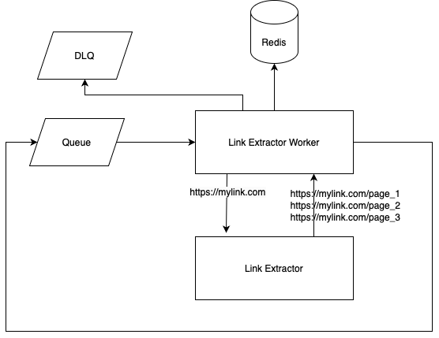

# Monzo Crawler

## Requirements

- Given a URL, fetch all other URLs on that page that are on the same domain and print them out
- Do not use existing web scraping tools
- Complete within 4 hours

My solution is a background worker that consumes URLs from a queue (in this case [Sidekiq](https://github.com/sidekiq/sidekiq), although in the real world likely SQS). When a URL is consumed, a HTTP request is made to it and all other URLs on that page are extracted. URLs from different domains or those that have already been processed are discarded. Those that remain are added onto the queue.

This is the design of the system I wanted:



## Trade offs

Given the 4 hour window I had to make some sacrifices:

- The queue choice is not ideal (Redis backed and no proper DLQ)
- All non-200 status codes are swallowed
- There's no retry mechanism or back-off
  - 429/5xx statuses could be enqueued again as there's a good chance it will succeed in the future
  - 401/403/404 should continue to swallow errors as we're unlikely to succeed in the future
- All redirects are blindly followed
- There's no concept of a job id so that multiple domains can be crawlled (or the same domain crawlled multiple times)
- If the same link is found in multiple processes at the same time, they will all be queued, resulting in duplicate work
  - Sidekiq deduplication is a paid feature so it is omitted here
  - SQS content-based deduplication would work well here
- I used Ruby, sorry

Limitations of this design (not related to the time window):

- The system is fully asynchronous and there's no callback when it is complete

## Thoughts on concurrency

The system can be scaled horizontally by increasing the number of workers.

To achieve this, you could add multiple workers to the docker-compose file like so:

```yaml
services:
  worker_1:
    ...
  worker_2:
    ...
```

## Real world experiement

I crawled https://monzo.com, you can see the results [here](./docs/monzo_crawl_results.md).

## Usage

I've included a basic docker setup as I'm guessing you won't have Ruby configured.

First, start the worker:

```bash
$ docker-compose up
```

In a seperate terminal session, kick off a job to crawl a site:

```bash
$ docker-compose run worker ./bin/crawl https://monzo.com
```

You will see the output in the worker logs.

## Running the tests

```bash
$ docker-compose run worker bundle exec rspec
```

## Running the linter

```bash
$ docker-compose run worker bundle exec rubocop
```
